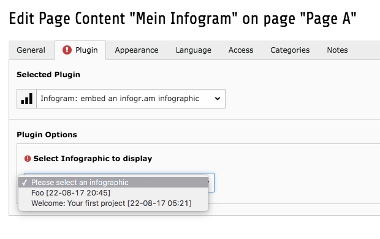

# TYPO3 CMS Extension `infogram`

> This extension implements the most important feature of infogr.am: Let TYPO3 backend editors add an infogram content element via infogr.am API (TYPO3 backend user can select an existing infogram right within the flexforms of the content element plugin)

## Requirements

- TYPO3 CMS 8.7 LTS
- infogr.am valid user account
- infogr.am API key
- infogr.am API secret
- infogr.am API username
- License: GPL 3

## Installation

### Installation using Composer

The recommended way to install the extension is by using [Composer](https://getcomposer.org/). In your Composer based TYPO3 project root, just do `composer require josefglatz/infogram`

### Installation as extension from TYPO3 Extension Repository (TER)

Download and install the extension with the TYPO3 CMS extension manager module or directly via [typo3.org](https://typo3.org/extensions/repository/view/infogram).
